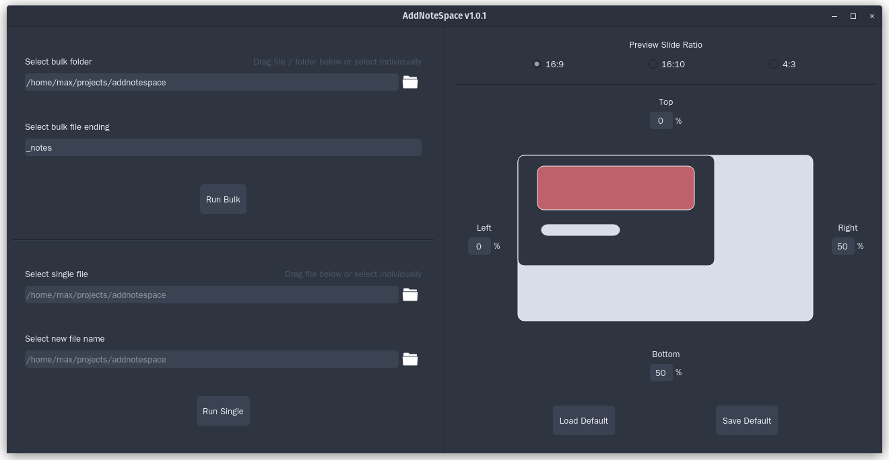

# AddNoteSpace

**Table of Contents**

- [Overview](#overview)
- [Installation](#installation)
- [License](#license)
- [TODO](#todo)

## Overview

Professors never leave enough space on their slides to take notes.
This tool allows you to add white space to every side of each page in a pdf file.

This can be done in bulk, where you select an entire folder, or by selecting
a single pdf file.

The configuration can be saved and loaded at will. For adding space in bulk,
there is an additional `run_bulk.exe`, which uses your default values.

Features include:

- Add whitespace to each side of the slides
- Run on all pdfs in a directory, or select a single one
- Drag and Drop of files/folders into the app
- Save settings as default
- Individual executable for running a bulk run
- CLI

## Installation

Head to the [Releases page](https://github.com/maromei/addnotespace/releases)
and download the latest `*.zip` file. For your platform.
The extracted content can be placed anywhere on
your pc. This tool functions as a standalone.
For easy access create a shortcut for the `addnotespace.exe` and
`run_bulk.exe` on windows. On linux you should add these binaries to your path.

## License

`addnotespace` is distributed under the terms of the [MIT](https://spdx.org/licenses/MIT.html) license.

## TODO:

- tooltip
- sphinx doc
- figure out how to check for updates without triggering windows defender
